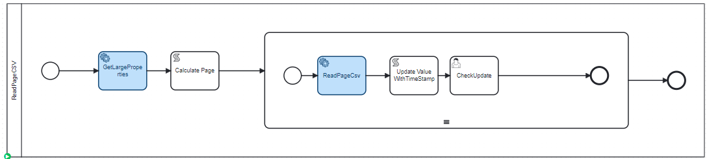
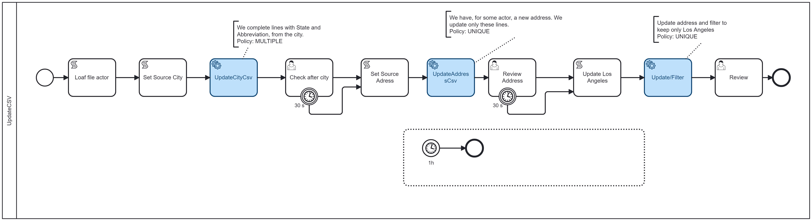

[](https://github.com/Camunda-Community-Hub/community/blob/main/extension-lifecycle.md#stable-)
[](https://github.com/camunda-community-hub/community)


# camunda-8-connector-csv

This connector is used to manage CSV files. Read files (with filter and pagination), write files, and update files.


# Principle

TODO
Remove reader/writer to have only ProcessCSV / GetProperties


Input 

## CSV

A CVS is an ASCII file.
The file contains multiple line.
The first line is the definition, and each other line are records, one record per line.
The definition line contains a series of fields separate by a separator. By default, the separator is a ";".


Example:
````
FirstName;LastName;Email;Address;City:Country
Pierre-Yves;Monnet;pierre-yves.monnet@camunda.com;833 Washington av;San Francisco;USA
Francis;Hulster;francis.hustler@cinema.fr;65 champs Elysée;Paris;France
````
 


## Access the file

The FileStorage library (https://github.com/camunda-community-hub/zebee-filestorage) is used.
File can be available via URL, CMIS drive, or anywhere the FileStorage library manage. 


# Functions available in the connector

* get-properties

Return information on the CSV: number of items, headers, multi format CSV or unique


* read

Read a CSV, and produce a list of Map. A converter can be associate (to transform a String in Integer, or a String in a java.util.date)
A page number, and number of records in the page is given to handle large CSV and protect the reader.
A multi header CSV can be manage by the reader

A filter can be added during the read, via multiple key (read only data where amount > 1000)



* write - append

Write a List of Map in a CSV. A converter can be associated, to transform a java.util.Date to a special string format.
The writer can append data in an existing CSV, and it will respect the format of the existing CSV then.

As option, it can update the CSV to add new columns

* update a CVS

Update an existing CVS with a List of Map. A converter is provided, and correlation keys (for example, the correlation key is 'firstName', 'lastname') to find the record in the existing CSV.


**Flow functions**

These functions do not provide any process variable with data, but process CSV file completely and produce a new CSV file.

* Merge

Merge two CSV files in one file. It can merge only data (assuming the first CSV is the reference) or data and header

* filter

Filter a complete CSV file to a new file.

# Streamers

Each function onboard streamer. Streamer filter the input to keep only some data records.
The pagination streamer is one of them.

## Selector Streamer

The selection streamer verify if the record should be kept or rejected.

A filter is a MAP record: a key-value record.

For example, the filter keep only people named Lewis, living in USA
```json
{"lastName": "Lewis", "country":"USA"}
```


| Name    | Description                             | Class          | Default | Level     |
|---------|-----------------------------------------|----------------|---------|-----------|
| Filter  | Filter to apply                         | java.lang.Map  |         | OPTIONAL  |


## Pagination Streamer
This streamer take two inputs: the page size and the page number (which start at 0)

| Name       | Description                              | Class              | Default | Level     |
|------------|------------------------------------------|--------------------|---------|-----------|
| pageSize   | Size of one page                         | java.lang.Integer  |         | REQUIRED  |
| PageNumber | Number of the page to read (start at 0)  | java.lang.Integer  |         | REQUIRED  |


# Transformers

Each function onboard Transformer. There are two kind of transformers:
* String to object. Then, when a CSV file is read, a String type like `2024-05-23 11:43:13` can be translated to a Date object.
* Object to String. These transformers are more used during a Write operation, to transform a Date object to a String.

## FieldList
The field list keep only some fields (column).

For example, in the Input is
```cvs
firstName;lastName;email;address;city;zipcode;country
Leonardo;DiCaprio;leo@example.com;123 Hollywood Blvd;Los Angeles;90038;USA
```

apply the filter
```json
[ "firstName", "lastName", "email"]
```

The result is
```cvs
firstName;lastName;email
Leonardo;DiCaprio;leo@example.com;123 Hollywood Blvd;Los Angeles;90038;USA
```

| Name          | Description            | Class           | Default | Level    |
|---------------|------------------------|-----------------|---------|----------|
| fieldsResult  | List of fields to kept | java.lang.List  |         | OPTIONAL |

## Mapper

A function is applicable on a field in the CSV. It impact the field, but a function can impact other fields in the data.

| Name    | Description            | Class           | Default | Level    |
|---------|------------------------|-----------------|---------|----------|
| mappers | List of fields to kept | java.lang.List  |         | OPTIONAL |


Mappers are describe in a JSON,as a Map.
The key is the name of the field. The value is the mapper to apply on the field.
Each mapper is on the form `<Name>(<Parameters>)`. Parameters is a list of value:key, and the orders of parameters does not care.

An Input mappers:
```json
{
  "stamp": "now(LocalDate)",
  "PIB": "StringToCurrency(locale:US,unitField:PIBCurrency,error:0)",
  "Population": "StringToLong(locale:US,error:null)",
  "age": "StringToInteger(error:0)",
  "averageAgeParent": "StringToDouble(error:null)",
  "distanceWork": "StringToFloat(error:null)",
  "emailPerso": "Email(error:null)",
  "DateOfLastElection": "StringToDate(format:yyyy-MM-dd,typeData:LocalDate,error:null)",
  "Production": "StringToUnit(typeData:Double,locale:US,unitField:ProductionUnit,error:0)",
  "CapitalDistance": "StringToUnit(locale:US,unitField:CapitalDistanceUnit,error:0)"
}
```

An OutputMapper
```json
{
  "stamp": "now(LocalDate)",
  "age": "NumberToString(locale:US)",
  "averageAgeParent": "NumberToString(locale:US)",
  "distanceWork": "NumberToString(locale:US)",
  "PIB": "CurrencyToString(locale:US,unitField:PIBCurrency)",
  "DateOfLastElection": "DateToString(format:yyyy-MM-dd)",
  "CapitalDistance": "UnitToString(locale:US,unitField:CapitalDistanceUnit)"
}
```

#### Now

Set in the field the current date and time. The date's type is given as parameter (see Data Date Types).

Parameters:

| parameter | explanation          |
|-----------|----------------------|
| typeData  | type of Java object  |

 
Example:

```
"stamp": "Now(typeData:LocalDate)"
```

#### StringToDate

Transform a string to a Data. The date's type is given as parameter (see Data Date Types).
The format is JAVA. Visit See https://docs.oracle.com/javase/8/docs/api/index.html?java/text/SimpleDateFormat.html
and https://docs.oracle.com/javase/8/docs/api/index.html?java/time/format/DateTimeFormatter.html.

Parameters:

| parameter | explanation                                              |
|-----------|----------------------------------------------------------|
| typeData  | type of Java object                                      |
| format    | format of the decode.                                    | 
| error     | Value in case of error, else throw an Connectorexception | 

Example:

```
"DateOfLastElection":"StringToDate(format:yyyy-MM-dd,typeData:LocalDate,error:null)"
```

#### StringToInteger

Transform a String in Integer. The number's type is given as parameter (see Number Date Types).
The Local is use to decrypte the string: `12,345.43` in the US is the same number as `12 345,43` in France.

Parameters:

| parameter | explanation                                                                         |
|-----------|-------------------------------------------------------------------------------------|
| typeData  | type of Java object                                                                 |
| locale    | Locale to decode the string. If not given, the default of the Java Machine is used  |
| error     | Value in case of error, else throw an Connectorexception | 


Example:

```
"age": "StringToInteger(error:0)",
```

#### StringToLong

"Population":"StringToLong(locale:US,error:null)",


#### StringToDouble

"averageage": "StringToDouble(error:null)",


####  StringToFloat

"distanceWork": "StringToFloat(error:null)",


#### StringToEmail

"emailPerso": "Email(error:null)",


#### StringToUnit

Example:
```
"CapitalDistance": "StringToUnit(locale:US,unitField:CapitalDistanceUnit,error:0)",
```


#### StringToCurrency
Extract from a string the value and the currency. Store the currenty in a different field.
The Locale is used to decode the number (see StringToDouble).

Example:
```
"PIB": "StringToCurrency(locale:US,unitField:PIBCurrency,error:0)",
```

The mapper does that change

| Value in PIB in CSV | Local | PIB         | PIBCurrency |
|---------------------|-------|-------------|-------------|
| $ 120               | US    | 120         | $           |
| $ 3,553.45323       | US    | 3554.45423  | $           |
| 554.45 EURO         | US    | 554.43      | EURO        |
| 554.45 €            | US    | 554.43      | €           |
| 554,45 €            | FR    | 554.43      | €           |

####  NumberToString

"age": "NumberToString(locale:US)",


Value in CSV

#### UnitToString

"Production":"UnitToString(locale:US,unitField:ProductionUnit)",

####  CurrencyToString

"PIB": "CurrencyToCurrency(locale:US,unitField:PIBCurrency)",

#### DateToString

"DateOfLastElection":"DateToString(format:yyyy-MM-dd)",


### Data Number Types

* Integer
* Long
* Double
* Float

### Data Date Types
* Date
* LocalDate
* LocalDateTime
* ZonedDateTime


# Get Info

## Principle


## Inputs
| Name               | Description                                                                                       | Class             | Default            | Level    |
|--------------------|---------------------------------------------------------------------------------------------------|-------------------|--------------------|----------|
| userRealm          | The user is created in a realm                                                                    | java.lang.String  | `camunda-platform` | REQUIRED |

(1) UserRole: give a string separate by n like "Operate,Tasklist" or "Optimize"

## Output
| Name          | Description                          | Class             | Level    |
|---------------|--------------------------------------|-------------------|----------|
| userId        | Id of user created (or updated)      | java.lang.String  | REQUIRED |

## BPMN Errors

| Name                   | Explanation                                                                        |
|------------------------|------------------------------------------------------------------------------------|
| KEYCLOAK_CONNECTION    | Error arrived during the Keycloak connection                                       |


# Update CSV

## Principle


Update and transform a CSV.



The CSV in Update pass the different Transformer and Streamer. It is possible to keep only part of the data.

### Transformers 

All transformers are available.

### Streamers

All streamers are available.

### Update
Then, the file is processed via the Update part.

The update take as input a **List Of Records** called **Matchers**. These records are stored in a process variable. 
The input **KeyFields** give the list of fields used for the correlation.

Each record of the CSV are checked with all the **Matcher**. When a record match (i.e. all keyField are identical) the record is updated by the matched data.

3 policy of update exists:

**MULTIPLE**

One record can be updated by multiple **Matcher**.

**SINGLEORNONE**
One record can be updates by 0 or 1 **Matcher**

**SINGLE**
One record must be updates by 1 and only 1 **Matcher**

Note: update is optional, so this function can be used only to run a transformer or a mapper.

Actually, running this function with an PROCESSVARIABLE as input and a STORAGE as output is the same function ad write-csv.
Running this function with a STORAGE as input and a PROCESSVARIABLE as output is the same function as read-csv


## Use case 1
In this CSV
```csv
firstName;lastName;email;address;city;zipcode;country
Harper;Wilson;harper.wilson0@example.com;663 Random St;Boston;68792;USA
Ethan;Jackson;ethan.jackson1@example.com;162 Random St;San Francisco;34490;USA
01;Monnet;01.monnet@example.com;162 Random St;San Francisco;34490;USA
Scarlett;Clark;scarlett.clark2@example.com;988 Random St;Boston;72830;USA
```

the need is to complete the CSV, adding a State name and State abbreviation.
The keyFields is 
```json
["city"]
```

The **Matcher** are.
```json
[{
  "city": "Boston",
  "state": "Massachusetts",
  "stateAbbreviation" : "MA"
},
 {
  "city": "Austin",
  "state": "Texas",
  "stateAbbreviation" : "TX"
},
  {
  "city": "Los Angeles",
  "state": "California",
  "stateAbbreviation" : "CA"
},
  {
  "city": "San Francisco",
  "state": "California",
  "stateAbbreviation" : "CA"
}
]
```
The first record, `data["city"] == "Boston"`. The first match is identity: `matcher["city"] == "Boston"`. The matcher is apply.
The data become

````
Harper;Wilson;harper.wilson0@example.com;663 Random St;Boston;68792;USA;Massachusetts;MA
````

For the second data, the matcher is `San Francisco`

The policyUpdate can be `MULTIPLE` or `SINGLEORNONE`, to not stop if the city is not in the list of matcher.

## Use case 2
In the same list, the address of an actor has to be updated.
The list of Matcher contains 
```json
   {
  "firstName": "Harper",
  "lastName": "Wilson",
  "address": "1435 Washington Av",
  "city": "Albany",
  "zipcode": "94706",
  "state": "California",
  "stateAbbreviation": "CA"
}
```
and the keyField is 
```json
["firstName", "lastName"]
```
The correlation is based on the actor name, and only one matcher is supposed to work. But all the content will not be updated.
So the policy is `SINGLEORNONE`


## Inputs
| Name               | Description                                                                                       | Class             | Default            | Level    |
|--------------------|---------------------------------------------------------------------------------------------------|-------------------|--------------------|----------|
| userRealm          | The user is created in a realm                                                                    | java.lang.String  | `camunda-platform` | REQUIRED |

(1) UserRole: give a string separate by n like "Operate,Tasklist" or "Optimize"

## Output
| Name                  | Description                                           | Class                    | Level    |
|-----------------------|-------------------------------------------------------|--------------------------|----------|
| csvHeader             | List of fields in the Header                          | List<java.lang.String>   | REQUIRED |
| numberOfRecords       | Number of record updated                              | Integer                  | REQUIRED |
| totalNumberOfRecords  | Number total of record processed                      | Integer                  | REQUIRED |
| fileVariableReference | it TypeStorage == STORAGE, the reference to the file  | File Variable            | OPTIONAL | 
| records               | if TypeStorage == PROCESSVARIABLE, the content        | List<Map<String,Object>> | OPTIONAL |

## BPMN Errors

| Name                   | Explanation                                                                        |
|------------------------|------------------------------------------------------------------------------------|
| KEYCLOAK_CONNECTION    | Error arrived during the Keycloak connection                                       |


# Build

```bash
mvn clean package
```

Two jars are produced. The jar with all dependencies can be uploaded in the [Cherry Framework](https://github.com/camunda-community-hub/zeebe-cherry-framework)

## Element Template

The element template can be found in the [element-templates](/element-templates/keycloak-function.json) directory.
