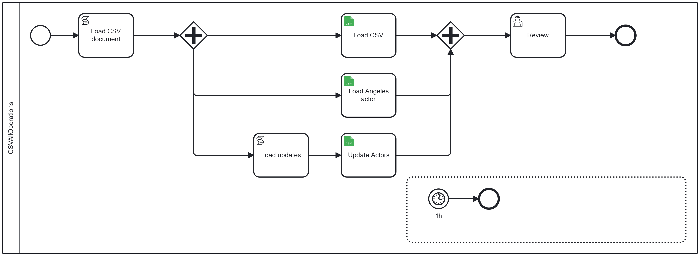

[](https://github.com/Camunda-Community-Hub/community/blob/main/extension-lifecycle.md#stable-)
[](https://github.com/camunda-community-hub/community)


# camunda-8-connector-csv

This connector is used to manage CSV files. It can read files (with filter and pagination), write files, and update files.



# Principle


## CSV

A CVS is an ASCII file.
The file contains multiple lines.
The first line is the definition, and each other line is a record, one record per line.
The definition line contains a series of fields separated by a separator. By default, the separator is a ";".


Example:
```csv
FirstName;LastName;Email;Address;City:Country
Pierre-Yves;Monnet;pierre-yves.monnet@camunda.com;833 Washington av;San Francisco;USA
Francis;Hulster;francis.hustler@cinema.fr;65 champs Elysée;Paris;France
Daniel;Anderson;daniel.anderson624@example.com;367 Random St;Los Angeles
```


## Reader

The Reader can be
* a process variable
* a file


The FileStorage library (https://github.com/camunda-community-hub/zebee-filestorage) is used.
The file can be available via URL, CMIS drive, or anywhere the FileStorage library manages.

## Filters
Filters can be applied to extract only some information, like actors living in Los Angeles.

Pagination is a filter that returns only a specific page.

## Transformers
Transformers change the content. Columns can be added or removed, and string fields can be transformed into Integers or Dates.

Conversely, some Object String transformations can be applied to transform a Java.lang.date into a String. This is useful when the source is a process variable and a CSV is built.

## Matchers

Matcher is used to update the content. For example, I could change Daniel Anderson's address.

Matcher references a set of data. For example
```
FirstName;LastName;Address;City
Daniel;Anderson;412 Washington av;Albany;
````
Matcher uses a key (for example, `FirstName` and `LastName`).
Matcher updates the content when the correlation matches.

## Writer

Different writers exist to store the result
* in a process variable
* in a file. Any file supported by the FileStorage is accepted.


# Functions available in the connector

The connector asks for a function. The function determines the management inside the connector.

## get-properties


Return information on the CSV, including the number of items and headers. During the get-properties, a filter can be used to obtain unique information.
The function returns the total number (number of records) and the number according to the filter. For example, with a filter `city=Paris`, the function returns the number of records for which the city is Paris.

The get-properties use Reader and accept Filters.


### Inputs

See Readers section

See Filter sections


### Output

| Name                  | Description                                       | Class                    | Level    |
|-----------------------|---------------------------------------------------|--------------------------|----------|
| csvHeader             | List of fields in the Header                      | List<java.lang.String>   | REQUIRED |
| numberOfRecords       | Number of record updated                          | Integer                  | REQUIRED |
| totalNumberOfRecords  | Number total of record processed                  | Integer                  | REQUIRED |
| fileVariableReference | it TypeStorage == FILE, the reference to the file | File Variable            | OPTIONAL | 
| records               | if TypeStorage == PROCESSVARIABLE, the content    | List<Map<String,Object>> | OPTIONAL |

### BPMN Errors


| Name                     | Explanation                                                     |
|--------------------------|-----------------------------------------------------------------|
| ERROR_UNKNOWN_FUNCTION   | The function is unknown. There is a limited number of operation |
| GET_PROPERTIES           | Error during the get-properties                                 |
| CANT_PROCESS_CSV        | Error during processing the CSV                                                | 
| TOO_MUCH_FIELDS_IN_LINE | The header describe some fields, and a line describe more fields               |
| NO_HEADER               | A Csv file must have one line, to describe the list of fields in the CSV file  |  

See Reader, Filter section.

## Process

The process accepts all operations: Reader, Filter, Transformer, Matcher, Writer.

For example, to read a CSV file to a process variable, the Reader is `File`, and pagination may be used. The Writer is a `process variable` .

To write a CSV file from a process variable, the Reader will be `processVariable`, and the Writer `File`

To filter a file, the Reader is `File`, a filter is defined, and the Writer is `File`.

### Inputs

See Reader, Filter, Transformer, Mapper, Writer section.


### Output
| Name                  | Description                                       | Class                    | Level    |
|-----------------------|---------------------------------------------------|--------------------------|----------|
| csvHeader             | List of fields in the Header                      | List<java.lang.String>   | REQUIRED |
| numberOfRecords       | Number of record updated                          | Integer                  | REQUIRED |
| totalNumberOfRecords  | Number total of record processed                  | Integer                  | REQUIRED |
| fileVariableReference | it TypeStorage == FILE, the reference to the file | File Variable            | OPTIONAL | 
| records               | if TypeStorage == PROCESSVARIABLE, the content    | List<Map<String,Object>> | OPTIONAL |

### BPMN Errors

See Reader, Filter, Transformer, Mapper, Writer section.

| Name                    | Explanation                                                                    |
|-------------------------|--------------------------------------------------------------------------------|
| ERROR_UNKNOWN_FUNCTION  | The function is unknown. There is a limited number of operation                |
| CANT_PROCESS_CSV        | Error during processing the CSV                                                | 
| TOO_MUCH_FIELDS_IN_LINE | The header describe some fields, and a line describe more fields               |
| NO_HEADER               | A Csv file must have one line, to describe the list of fields in the CSV file  |  
| BAD_STORAGE_DEFINITION  | Storage definition is not correct                                              |


# Functions

## Reader

There are two readers:
* Process variable. The structure is a `List<Map<String, Object>>`. If this is not the variable's structure, the error is thrown.
* File. Any file referenced via the FileStorage is accepted. The file must be an ASCII (Charset is a parameter) with multiple lines. Each column is separated by a Separator (a parameter). The first line defines the Header.

Inputs:

| Name               | Description                                                                                       | Class             | Default            | Level    |
|--------------------|---------------------------------------------------------------------------------------------------|-------------------|--------------------|----------|
| userRealm          | The user is created in a realm                                                                    | java.lang.String  | `camunda-platform` | REQUIRED |

Bpmn errors:

| Name                      | Explanation                                       |
|---------------------------|---------------------------------------------------|
| CANT_ACCESS_INPUTRECORDS  | InputRecord variable is not defined               |                               
| CANT_ACCESS_FILE          | Csv File can't be accessible                      |
| UNSUPPORTED_TYPE_STORAGE  | The Type storage is not supported by the function |

## Filter

A Filter reduces the content.

There are two filters:
* Selection
* Pagination


### Selection

The selection filter verifies if the record should be kept or rejected.

A filter is a MAP record: a key-value record.

For example, the filter keeps only people named Lewis living in the USA
`````json
{"lastName": "Lewis", "country": "USA"}
`````

**Inputs:**

| Name    | Description                             | Class          | Default | Level     |
|---------|-----------------------------------------|----------------|---------|-----------|
| Filter  | Filter to apply                         | java.lang.Map  |         | OPTIONAL  |

**Bpmn errors:**

No errors


### Pagination Filter
This filter takes two inputs: the page size and the page number (which start at 0)

**Inputs:**

| Name       | Description                              | Class              | Default | Level     |
|------------|------------------------------------------|--------------------|---------|-----------|
| pageSize   | Size of one page                         | java.lang.Integer  |         | REQUIRED  |
| PageNumber | Number of the page to read (start at 0)  | java.lang.Integer  |         | REQUIRED  |

**Bpmn errors:**
 
No errors

## Transformers

Each function onboard the Transformer. There are two kinds of transformers:
* String to object. Then, when a CSV file is read, a String type like `2024-05-23 11:43:13` can be translated to a Date object.
* Object to String. These transformers are used more during a write operation to transform a date object into a string.

### FieldList
The field list keeps only some fields (column).

For example, the Input is
`````cvs
firstName;lastName;email;address;city;zipcode;country
Leonardo;DiCaprio;leo@example.com;123 Hollywood Blvd;Los Angeles;90038;USA
`````

apply the fieldList
`````json
["firstName", "lastName", "email"]
`````

The result is
`````cvs
firstName;lastName;email
Leonardo;DiCaprio;leo@example.com;123 Hollywood Blvd;Los Angeles;90038;USA
`````

**Inputs:**

| Name          | Description            | Class           | Default | Level    |
|---------------|------------------------|-----------------|---------|----------|
| fieldsResult  | List of fields to kept | java.lang.List  |         | OPTIONAL |

**Bpmn errors:**

No errors

## Operation

An operation applies to a field in the CSV. It impacts the field, but a function can impact other fields in the data.

**Inputs:**

| Name       | Description        | Class         | Default | Level    |
|------------|--------------------|---------------|---------|----------|
| operations | List of operation  | java.lang.Map |         | OPTIONAL |

**Bpmn errors:**

| Name                           | Explanation                                                          |
|--------------------------------|----------------------------------------------------------------------|
| BAD_TRANSFORMATION_DEFINITION  | The operation given does not have the expected number of parameters  |
| BAD_TRANSFORMATION_EXECUTION   | Error during execute an operation                                    |


Operations are described in a JSON as a Map.
The key is the field's name, and the Value is the mapper to be applied to it.
Each mapper is on the form `<Name>(<Parameters>)`. Parameters are a list of Values:key and the order of parameters do not care.

Input mappers:
`````json
{
"stamp": "now(LocalDate)",
"PIB": "StringToCurrency(locale:US,unitField:PIBCurrency,error:0)",
"Population": "StringToLong(locale:US,error:null)",
"age": "StringToInteger(error:0)",
"averageAgeParent": "StringToDouble(error:null)",
"distanceWork": "StringToFloat(error:null)",
"emailPerso": "Email(error:null)",
"DateOfLastElection": "StringToDate(format:yyyy-MM-dd,typeData:LocalDate,error:null)",
"Production": "StringToUnit(typeData:Double,locale:US,unitField:ProductionUnit,error:0)",
"CapitalDistance": "StringToUnit(locale:US,unitField:CapitalDistanceUnit,error:0)"
}
`````

An OutputMapper
`````json
{
  "stamp": "now(LocalDate)",
  "age": "NumberToString(locale:US)",
  "averageAgeParent": "NumberToString(locale:US)",
  "distanceWork": "NumberToString(locale:US)",
  "PIB": "CurrencyToString(locale:US,unitField:PIBCurrency)",
  "DateOfLastElection": "DateToString(format:yyyy-MM-dd)",
  "CapitalDistance": "UnitToString(locale:US,unitField:CapitalDistanceUnit)"
}
`````


#### Now

The current date and time are set in the field. The date's type is given as a parameter (see Data Date Types).

Parameters:

| parameter | explanation          |
|-----------|----------------------|
| typeData  | type of Java object  |


Example:

`````
"stamp": "Now(typeData:LocalDate)"
`````


#### StringToDate

Transform a string to a Data. The date's type is given as a parameter (see Data Date Types).
The format is JAVA. Visit See https://docs.oracle.com/javase/8/docs/api/index.html?java/text/SimpleDateFormat.html
and https://docs.oracle.com/javase/8/docs/api/index.html?java/time/format/DateTimeFormatter.html.

Parameters:

| parameter | explanation                                              |
|-----------|----------------------------------------------------------|
| typeData  | type of Java object                                      |
| format    | format of the decode.                                    | 
| error     | Value in case of error, else throw a Connectorexception | 

Example:

`````
"DateOfLastElection":"StringToDate(format:yyyy-MM-dd,typeData:LocalDate,error:null)"
`````


#### StringToInteger

Transform a String in Integer. The number's type is a parameter (see Number Date Types).
The Local decrypts the string: `12,345.43` in the US, the same number as '12 345,43` in France.

Parameters:

| parameter | explanation                                                                         |
|-----------|-------------------------------------------------------------------------------------|
| typeData  | type of Java object                                                                 |
| locale    | Locale to decode the string. If not given, the default of the Java Machine is used  |
| error     | Value in case of error, else throw a Connectorexception | 


Example:

`````
"age": "StringToInteger(error:0)",
`````


#### StringToLong

Transform a String to long. The string can define local number, like `1,234,567` in the US,
where the same number is `1 234 567` in France.
if an error parameter is provided, this is used in case of error. If the parameter is not provided, then an exception is throw.

Null is a value: the object cbntains null.
Example:
`````
"Population":"StringToLong(locale:US,error:null)",
`````


#### StringToDouble

Same as the String To Long, but for double. The decimal separator change according the local.

`````
"averageage": "StringToDouble(locale:US,error:0)",
`````


####  StringToFloat

Same as String to Long, but produce a Float. Decimal separator change according to the local.
`````
"distanceWork": "StringToFloat(locale:US,error:12)",
`````


#### StringToEmail

Check the string is an email, meaning containing an @ in the content.
`````
"emailPerso": "Email(error:null)",
`````

#### StringToUnit

The String To unit get a String like `544 Kwh` and transform it in two values:
* the number in Double (544)
* the unit (Kwh)

Locale is used to define the method to decrypt the number. UnitField is the fied where the unit will be saved. 

Example:
`````
"CapitalDistance": "StringToUnit(locale:US,unitField:CapitalDistanceUnit,error:0)",
`````


#### StringToCurrency
The operation works the same as the StringToUnit

It get a String like `$5466.45` or `45655 €`and transform it in two values:
* the number in Double (5466.45 or 45655)
* the currency ($ or €)

Locale is used to define the method to decrypt the number. UnitField is the fied where the unit will be saved.

Example:
```
"PIB": "StringToCurrency(locale:US,unitField:PIBCurrency,error:0)",
```

The mapper does that change.

| Value in PIB in CSV | Local | PIB         | PIBCurrency |
|---------------------|-------|-------------|-------------|
| $ 120               | US    | 120         | $           |
| $ 3,553.45323       | US    | 3554.45423  | $           |
| 554.45 EURO         | US    | 554.43      | EURO        |
| 554.45 €            | US    | 554.43      | €           |
| 554,45 €            | FR    | 554.43      | €           |

####  NumberToString

Transform a number to a String, using the Local to format it.

```
"age": "NumberToString(locale:US)",
```


#### UnitToString

Take two fields, and create one, merging the unitField at the end.

```
"Production":"UnitToString(locale:US,unitField:ProductionUnit)",
```

####  CurrencyToString

Take two fields, merging them. The $ currency is placed in head of the number
```
"PIB": "CurrencyToCurrency(locale:US,unitField:PIBCurrency)",
```

#### DateToString

Take a date, and transform it using the format.

```
"DateOfLastElection":"DateToString(format:yyyy-MM-dd)",
```

### Data Number Types

The different data type supported are

* Integer
* Long
* Double
* Float

### Data Date Types
The different data type supported are

* Date
* LocalDate
* LocalDateTime
* ZonedDateTime


## Matcher


The update takes as Input a **List Of Records** called **Matchers**. These records are stored in a process variable.
The Input **KeyFields** lists the fields used for the correlation.

Each record of the CSV is checked with all the **Matcher**. When a record matches (i.e., all keyFields are identical), the record is updated with the matched data.

3 policies of update exist:

**MULTIPLE**

One record can be updated by multiple **Matcher**.

**SINGLEORNONE**
One record can be updated by 0 or 1 **Matcher**

**SINGLE**
One record must be updated by 1 and only 1 **Matcher**

Note: Update is optional, so this function can only run a transformer or a mapper.


Inputs:

| Name       | Description        | Class         | Default | Level    |
|------------|--------------------|---------------|---------|----------|
| operations | List of operation  | java.lang.Map |         | OPTIONAL |


BPMN Errors:

| Name                                  | Explanation                                                             |
|---------------------------------------|-------------------------------------------------------------------------|
| BAD_MATCHER_DEFINITION                | A matcher must define the keys used for the correlation                 |
| ONE_RECORD_DOES_NOT_MATCH_UNIQUEEACH  | The update policy specify each item must match one and only one record  |
| ONE_RECORD_DOES_NOT_MATCH_UNIQUE      | The update policy specify each item must match one, or no record        |


## Use case 1
In this CSV
```csv
firstName;lastName;email;address;city;zipcode;country
Harper;Wilson;harper.wilson0@example.com;663 Random St;Boston;68792;USA
Ethan;Jackson;ethan.jackson1@example.com;162 Random St;San Francisco;34490;USA
01;Monnet;01.monnet@example.com;162 Random St;San Francisco;34490;USA
Scarlett;Clark;scarlett.clark2@example.com;988 Random St;Boston;72830;USA
```

The CSV must be completed by adding a state name and state abbreviation.
The keyFields is
```json
["city"]
```

The result is
```json
[{
"city": "Boston",
"state": "Massachusetts",
"stateAbbreviation": "MA"
},
{
"city": "Austin",
"state": "Texas",
"stateAbbreviation": "TX"
},
{
"city": "Los Angeles",
"state": "California",
"stateAbbreviation": "CA"
},
{
"city": "San Francisco",
"state": "California",
"stateAbbreviation": "CA"
}
]
```
The first record, `data["city"] == "Boston"`. The first match is identity: `matcher["city"] == "Boston"`. The Matcher is applied.
The data become

````
Harper;Wilson;harper.wilson0@example.com;663 Random St;Boston;68792;USA;Massachusetts;MA
````

For the second data, the Matcher is `San Francisco`.

The policy update can be `MULTIPLE` or `SINGLEORNONE`, to not stop if the city is not on the list of Matcher.

## Use case 2
In the same list, an actor's address must be updated.
The list of matches contains
```json
   {
  "firstName": "Harper",
  "lastName": "Wilson",
  "address": "1435 Washington Av",
  "city": "Albany",
  "zipcode": "94706",
  "state": "California",
  "stateAbbreviation": "CA"
}
```
and the keyField is
```json
["firstName", "lastName"]
```
The correlation is based on the actor's name, and only one Matcher is supposed to work. But all the content will not be updated.
So the policy is `SINGLEORNONE`


# Build

```bash
mvn clean package
```

Two jars are produced. The jar with all dependencies can be uploaded in the [Cherry Framework](https://github.com/camunda-community-hub/zeebe-cherry-framework)

## Element Template

The element template can be found in the [element-templates](/element-templates/keycloak-function.json) directory.